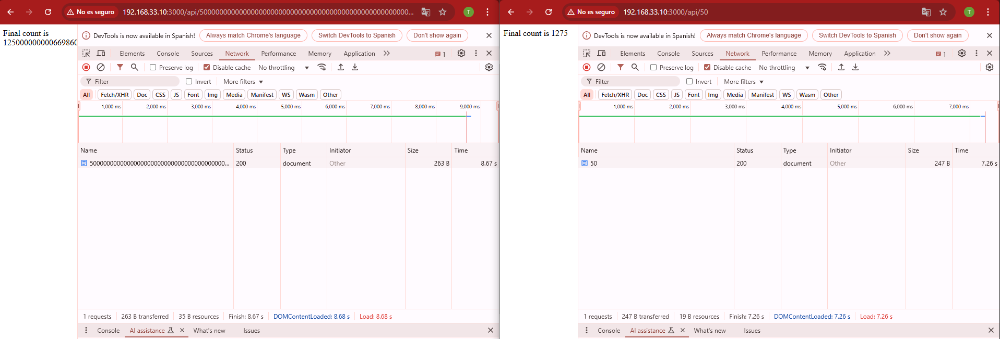
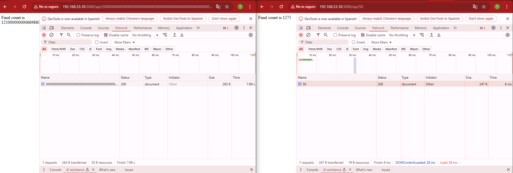
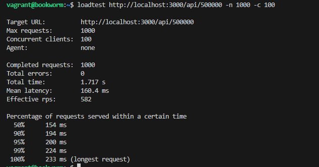
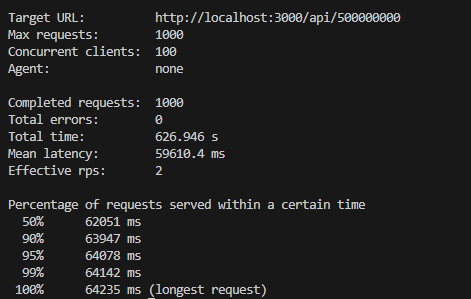
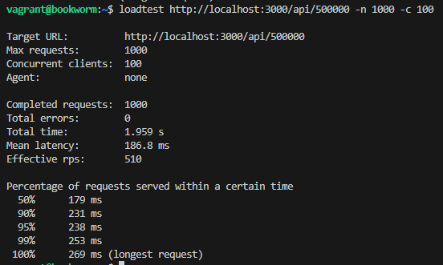
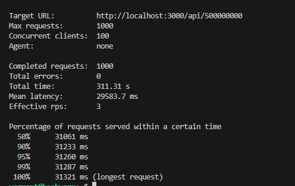
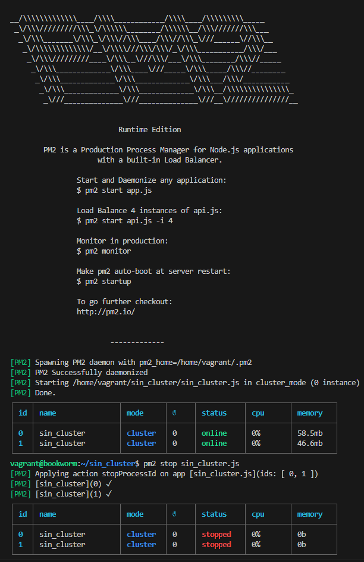
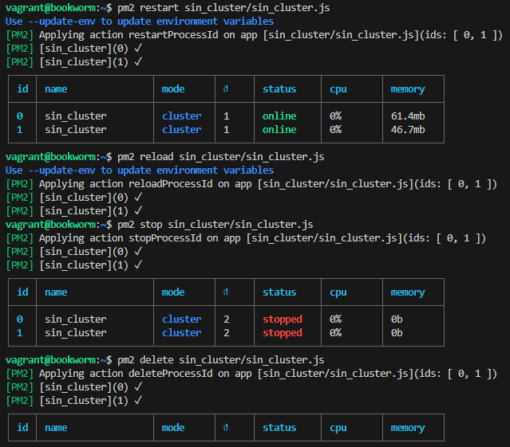

# Despliegue de una aplicación en cluster con Node Express

## Usando los clusters

### Primero sin clúster

1. La primera solicitud, al tener un valor de n grande, nos lleva unos cuantos segundos completarla.
2. La segunda solicitud, pese a tener un valor de n que ya habíamos comprobado que ofrecía una respuesta casi inmediata, también se demora unos segundos.

</img>

### Ahora con clúster

Ahora la segunda solicitud espera a que termine la primera para ofrecer una respuesta.

</img>

## Loadtest

### Sin clúster

Mientras ejecutamos la aplicación, en otro terminal realizamos la siguiente prueba de carga:
loadtest http://localhost:3000/api/500000 -n 1000 -c 100

1. Cantidad de núcleos: En blanco
2. Tiempo total de prueba: 1. 717 s
3. Latencia media, el tiempo promedio que tarda en completar una solicitud: 160. 4 ms 
4. RPS (Request per second) o peticiones por segundo: 582
</img>

- Ahora aumentando la api a 500000000

1. Tiempo total: 626. 946 s
2. Latencia media: 59610. 4 ms
3. RPS: 2
</img>

### Con clúster

1. Cantidad de núcleos: En blanco
2. Tiempo total de prueba: 1. 959 s
3. Latencia media, el tiempo promedio que tarda en completar una solicitud: 168. 8 ms 
4. RPS (Request per second) o peticiones por segundo: 510
</img>

- Ahora aumentando la api a 500000000

1. Tiempo total: 311. 31 s
2. Latencia media: 29583. 7 ms
3. RPS: 3
</img>

## PM2

Vamos a utilizarlo con nuestra primera aplicación, la que no estaba clusterizada en el código. Para ello ejecutaremos el siguiente comando:
pm2 start sin_cluster.js -i 0

</img>

- pm2 ecosystem
- pm2 start ecosystem.config.js

</img>

Podremos iniciar, reiniciar, recargar, detener y eliminar una aplicación con pm2.

</img>

## Cuestión
- ¿Sabrías decir por qué en algunos casos concretos, como este, la aplicación sin clusterizar tiene mejores resultados?

A veces, la aplicación sin clusterizar da mejores resultados porque los datos no tienen una estructura clara para dividir en grupos. Si intentamos dividirlos de todos modos, podemos complicar el modelo innecesariamente, perdiendo información o haciendo que se ajuste demasiado a los datos de entrenamiento, lo que puede reducir la precisión. En resumen, si no hay una razón fuerte para clusterizar, es mejor no hacerlo.